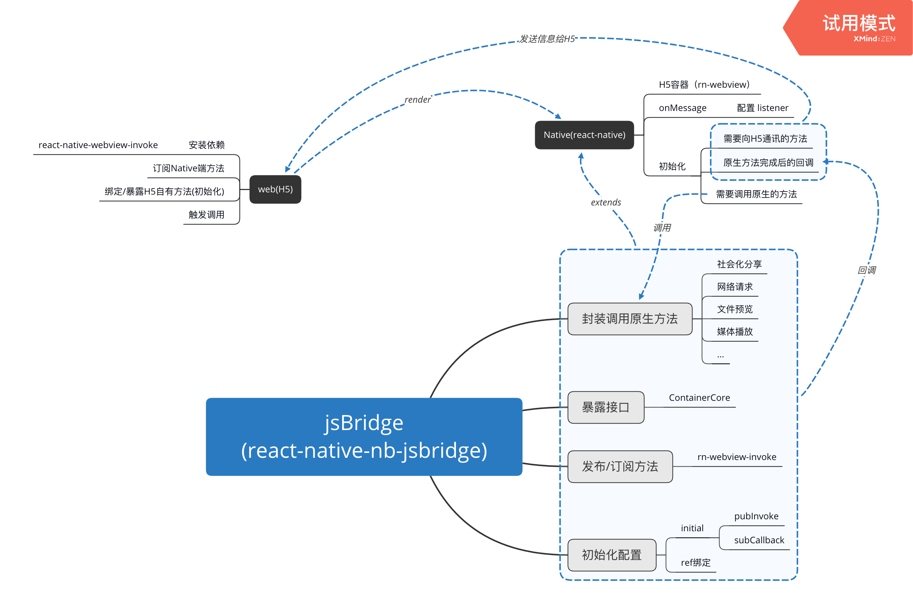

## JsBridge 可行性分析报告V-1(内部)

   Author: Pan Hankins
   Date: Jan 15, 2021
   tags: jsBridge

   ### 集成目标

   1. ReactNative与H5双向通讯
   2. H5通过Bridge调用原生方法，方法完成后的回调
   3. Bridge黑盒操作（隐藏部分数据通讯细节）
   4. Bridge的可扩展性、易用性、兼容性

   ### 相关依赖

   1. `react-native`
   2. `react-native-webview`
   3. `react-native-webview-invoke`

   ### 基本原理

   

   ### 封装输出

   1. `react-native-nb-jsbridge`

   ### 调用方法

   1. 核心代码

      ```jsx
      // native.js
      
      import React, { useEffect, useState, Component } from 'react';
      import {
        View,
        Text,
      } from 'react-native';
      
      import WebView from 'react-native-webview';
      import { ContainerCore } from 'react-native-nb-jsbridge';
      
      class WebBase extends ContainerCore {
        constructor (props) {
          super(props);
          this.state = {
            url: 'http://10.5.8.222:3000/',
          };
      
          this.pubInvokeList = [
            { onHandle: 'onShowShare', fn: this.doHandleShowShare.bind(this) },
            { onHandle: 'onShowAlert', fn: this.doHandleShowAlert.bind(this) },
          ];
      
          super.initial({
            pubInvoke: this.pubInvokeList,
            subCallback: this.onSubCallBack.bind(this),
          });
        }
      
        componentDidMount () {
          this.onShowMessageTips = this.invoke.bind('onShowMessageTips');
        }
      
        doHandleShowShare () {
          return this.showShareSheet({});
        }
      
        doHandleShowAlert () {
          return alert('show alert');
        }
      
        onSubCallBack = async () => {
          await this.onShowMessageTips();
        };
      
        onCancel = () => {
          this.setState({ isOpen: false });
        };
      
        renderLoading () {
          return (
            <View>
              <Text>{'loading'}</Text>
            </View>
          );
        }
      
        renderError () {
          return (
            <View>
              <Text>{'error'}</Text>
            </View>
          );
        }
      
        renderBody () {
        // render () {
          const { url } = this.state;
      
          return (
            <WebView
              source={{ uri: url }}
              startInLoadingState={true}
              renderLoading={() => this.renderLoading()}
              renderError={() => this.renderError()}
              ref={(r) => (this.webref = r)}
              // source={{
              //   uri:
              //     'https://github.com/react-native-community/react-native-webview',
              // }}
              // source={{ html }}
              // onMessage={(event) => {
              //   // console.log('======= event >>>>>', event);
              //   alert(event.nativeEvent.data);
              // }}
              onMessage={this.invoke.listener}
              // injectedJavaScript={runFirst}
            />
          );
        }
      }
      
      export default WebBase;
      ```


      ```jsx
      // web.js ### 伪代码有删改 ### 
      import React from 'react'
      import { enquireScreen } from 'enquire-js'
      **import invoke from 'react-native-webview-invoke/browser'**
      import { message } from 'antd'
      
      // listener
      **const onShowShare = invoke.bind('onShowShare')
      const onShowAlert = invoke.bind('onShowAlert')**
      
      export default class Home extends React.Component {
        constructor (props) {
          super(props)
          this.state = {
            isMobile,
            show: !location.port, // 如果不是 dva 2.0 请删除
          }
        }
      
        componentDidMount () {
          **invoke.define('onShowMessageTips', this.onShowMessageTips.bind(this))**
        }
      
        **onShowMessageTips () {
          return message.info('Native 发送消息到 H5 页面')
        }**
      
        **async onInvokeHandle (handleType) {
          //console.log('==== onInvokeHandle handleType >>>>', handleType)
          switch (handleType) {
            case 'Share':
              await onShowShare()
              break
            case 'Media':
              await onShowAlert()
              break
            default:
              break
          }
        }**
      
        **onHandleClick = (handleType) => {
          this.onInvokeHandle(handleType)
        }**
      
        render () {
          const children = [
            <Nav0
              id="Nav0_0"
              key="Nav0_0"
              dataSource={Nav00DataSource}
              isMobile={this.state.isMobile}
            />,
            <Banner0
              id="Banner0_0"
              key="Banner0_0"
              dataSource={Banner00DataSource}
              isMobile={this.state.isMobile}
            />,
            <Content0
              id="Content0_0"
              key="Content0_0"
              dataSource={Content00DataSource}
              isMobile={this.state.isMobile}
            />
          ]
          return (
            <div
              className="templates-wrapper"
              ref={(d) => {
                this.dom = d
              }}
            >
              {this.state.show && children}
            </div>
          )
        }
      }
      ```

      

   2. 扩展性

      - 维护 `jsbridge` 调用原生方法
      - Native端调用
